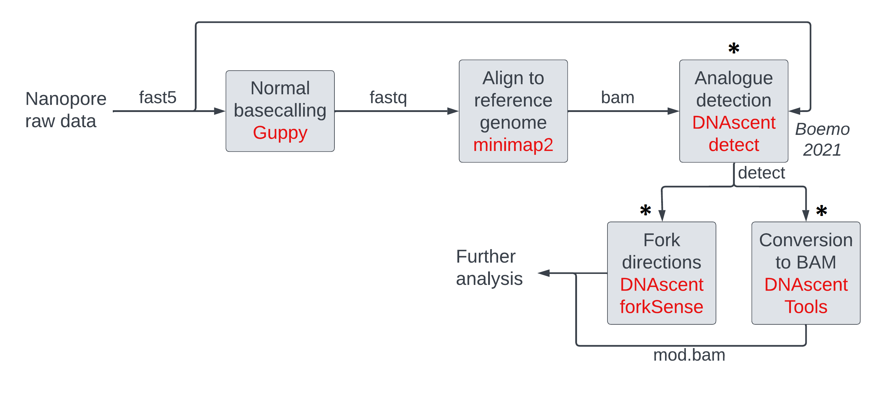
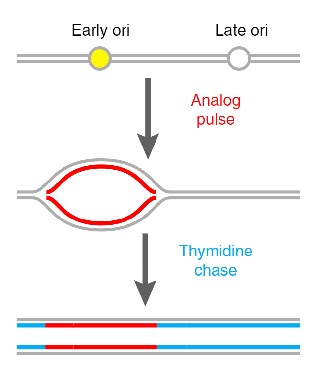

In this session, we will perform reference-anchored modification calling
on the dataset we have been using thus far — yeast DNA where some thymidines have been
substituted by BrdU.
We will use the software program `DNAscent` on the files already generated
by us from previous sessions (fast5, bam, sequencing summary file).
We will then convert the output of DNAscent into the standard mod bam format for storing
modification information.
Along the way, we will also learn the mod bam file format.
We will be performing the steps highlighted with an asterisk in the pipeline figure below.



## Running DNAscent to produce modification calls along each sequenced DNA strand

### Preparations to call modifications

We first need to download a plugin to help DNAscent read the later versions of fast5 files.

```bash
mkdir -p ~/nanomod_course_references # any suitable folder will do here.
cd ~/nanomod_course_references
wget https://github.com/nanoporetech/vbz_compression/releases/download/v1.0.1/ont-vbz-hdf-plugin-1.0.1-Linux-x86_64.tar.gz
tar -xvzf ont-vbz-hdf-plugin-1.0.1-Linux-x86_64.tar.gz
export HDF5_PLUGIN_PATH=$(pwd)/ont-vbz-hdf-plugin-1.0.1-Linux/usr/local/hdf5/lib/plugin
ls $HDF5_PLUGIN_PATH
# libvbz_hdf_plugin.so
rm ont-vbz-hdf-plugin-1.0.1-Linux-x86_64.tar.gz # if you see the output above, then cleanup by removing the tarball.
```

We now need to create an index needed by DNAscent — a plain text with two columns: read id
and the fast5 file with the corresponding time course of nanopore current.

```bash
input_fast5_dir=~/nanomod_course_data/yeast
output_index=~/nanomod_course_outputs/yeast/index.dnascent
input_seq_summ=~/nanomod_course_outputs/yeast/sequencing_summary.txt

DNAscent index -f $input_fast5_dir -o $output_index \
  -s $input_seq_summ
```

### Call modifications

We run the reference-anchored modification caller `DNAscent detect` here.
The program takes alignment information from the bam file, a reference genome,
and the raw nanopore currents as inputs and outputs the probability of modification
per thymidine per sequenced strand in a `.detect` format,
which is very similar to the TSV (tab-separated values) format.
The program uses a machine-learning approach where model parameters learned previously
represent differences in nanopore current characteristics between thymidine and BrdU.

The additional options below direct the program to use
8 computational threads and to reject alignments below a mapping quality of 20 and
a genome-mapped length of 1000 bases. 
By omitting the `--GPU` input parameter, we are running DNAscent in a slow, CPU-only mode
as the virtual machines used in the course do not have GPUs to lower costs.

```bash
input_bam=~/nanomod_course_outputs/yeast/aligned_reads.sorted.onlyPrim.bam
ref_genome=~/nanomod_course_references/sacCer3.fa
index=~/nanomod_course_outputs/yeast/index.dnascent
output_detect=~/nanomod_course_outputs/yeast/dnascent.detect
DNAscent detect -b $input_bam -r $ref_genome -i $index \
 -o $output_detect -t 8 -q 20 -l 1000
```

After the program has finished running, inspect the first few lines of the output
file using the `head` command

```bash
output_detect=~/nanomod_course_outputs/yeast/dnascent.detect
head -n 30 $output_detect
```

You should see:
- a few header lines starting with `#`
- data from each read starts with `>` and has information about its alignment
- the following lines give genomic alignment coordinate, BrdU probability,
and k-mer (on the reference strand)

## Call replication dynamics with DNAscent forkSense using single-molecule modification densities

After modifications are called, one can ask general questions common to all modification experiments
like which are the highly modified reads, what is the mean density per read etc.
One can also ask specific questions that are experiment-dependent.

In the experiments of the yeast dataset we have been using,
the specific questions are about DNA replication dynamics.
A specialized program called `forkSense` that ships with DNAscent detects gradients in BrdU density
across a read, and associates these with the movement of replication forks.
After fork calls are made, locations on the genome from which forks emerged are marked as
origins of replication, and locations where forks terminate are marked as termination sites.
Please see the figure below from Müller et al., Nat. Methods (2019).



We will look into these features more in a [session]({{ site.baseurl }}/lectures/case-study) tomorrow.
Today, we will just learn how to execute the `forkSense` command and save the biological interpretations
for tomorrow.

```bash
# Please change to the output directory using the cd command.
# There are lots of output files which go to the output directory.
input_detect=~/nanomod_course_outputs/yeast/dnascent.detect
output_forksense=~/nanomod_course_outputs/yeast/dnascent.forkSense
cd ~/nanomod_course_outputs/yeast/
DNAscent forkSense -d $input_detect -o $output_forksense \
 -t 8 --markOrigins --markTerminations --markForks
```

The above command will produce a few plain-text output files.
Inspect them using `shuf` and `head`; their names should be self-explanatory.
We will discuss them further in the [session]({{ site.baseurl }}/lectures/case-study) tomorrow.

## Conversion of DNAscent detect into the modBAM format

We convert modification data from the specific `.detect` format used by DNAscent to
the more widely used and standardized `.mod.bam` or mod BAM format using the package
DNAscentTools developed by the Nieduszynski group.
Mod BAM files are just BAM files with two additional tags per line that store
modification information. We will discuss their structure later on in this session.

```bash
input_detect=~/nanomod_course_outputs/yeast/dnascent.detect
output_mod_bam=~/nanomod_course_outputs/yeast/dnascent.detect.mod.bam
cd ~/nanomod_course_scripts/DNAscentTools
< $input_detect python convert_detect_to_modBAM.py \
  --op $output_mod_bam --tag T

# sort and index the BAM files
input_mod_bam=~/nanomod_course_outputs/yeast/dnascent.detect.mod.bam
output_mod_bam=~/nanomod_course_outputs/yeast/dnascent.detect.mod.sorted.bam
samtools sort -o $output_mod_bam $input_mod_bam
samtools index $output_mod_bam
```

## Inspect modification data by conversion from modBAM to TSV format using modkit

Without a discussion, it is not easy to understand what is in a raw mod BAM file.
So, before the discussion, let us convert the mod BAM file into the easy-to-understand tab-separated value
format so that we can get a quick look at our modification calls.
We will be using the `modkit` program developed by ONT that takes mod BAM files as input
and produces tabulated data or summary statistics as output.
One of the functions provided is `modkit extract`.

Please run the code below and inspect the output tsv file.
The most important columns are `read_id`, `forward_read_position`, and `mod_qual` as these answer
the fundamental question of modification calling: what is the likelihood of modification at every
position on every read?
Other useful columns are the position along the reference `ref_position`,
the length of the read `read_length` etc.
We can look up the full list in the official documentation [here](https://nanoporetech.github.io/modkit/intro_extract.html).

```bash
input_mod_bam=~/nanomod_course_outputs/yeast/dnascent.detect.mod.sorted.bam
output_tsv=~/nanomod_course_outputs/yeast/dnascent.detect.mod.sorted.bam.tsv
modkit extract $input_mod_bam $output_tsv
```

## Discussion of the modBAM file format

The mod BAM format is not very easy to read for a person.
Tools such as `modkit`, `samtools`, and `IGV` help us convert mod BAM files into an easily
readable format such as a table or an image.
You might find that such tools are adequate for your needs.
If you do not, then knowledge of the format helps you write tools yourself
and to perform some advanced manipulations.
As the modification field is still developing,
it is probable that you will come across such scenarios.
Thus, we conclude this session with a [discussion]({{ site.baseurl }}/materials/mod-bam-format)
 of the mod BAM file format.