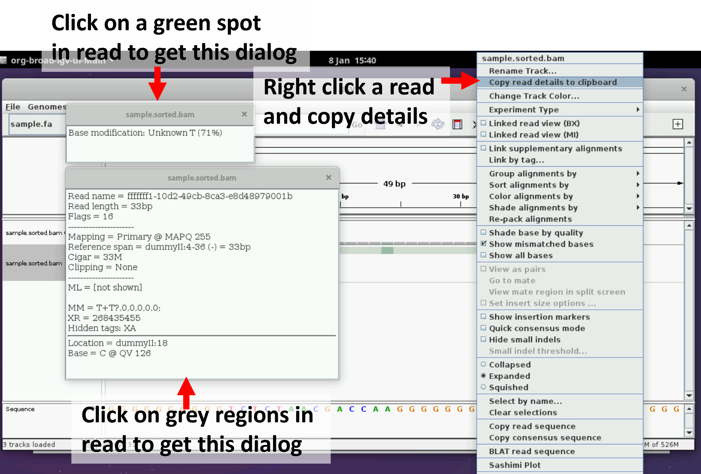
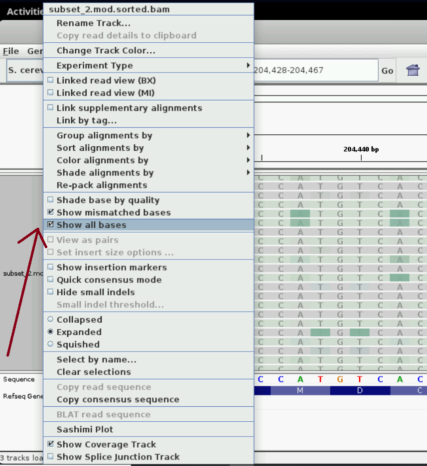

We have called modifications in a reference-anchored manner in the
[previous]({{ site.baseurl }}/materials/base-mod-detection) session.
Our goal in the next few sessions is to introduce several tools
that can be utilized to analyze modifications and show some sample ways
in which they can be executed.
The experimentalist must decide whether to use these tools, how to run these tools,
and/or whether new tools are needed depending on their experiment. 
Some of these tools will work irrespective of whether we use a reference-dependent or reference-independent
approach to call modifications.
We are at the 'further analysis' stage on our pipeline figure below.


In this session, we will visualize modification data in mod BAM files (see figure below) using (1) genome
browsers (left) where we can rapidly scan data visually across different reads and different
regions on the genome, and (2) custom scripts (right) which allow us to see modification
density versus coordinate one read at a time.
We will discuss another visualization tool
`modbamtools` which produces visualizations such as 
[these](https://rrazaghi.github.io/modbamtools/figs/gm12878_GNAS_hap_h3k27ac_h3k4me1.html)
in a [session]({{ site.baseurl }}/materials/single-molecule-visualization) tomorrow.


Either visualization has its strengths and weaknesses, which is why it is good to know how to do both.
Genome browsers give you an overall idea and one can zoom in to regions on the genome
and see data across multiple reads. But, beyond recognizing which regions are highly
modified on a read (green) and which regions are not (grey), one cannot pick out any
details of modification density such as gradients as there is no interpolation
between the two colours to show any intermediary densities.
Genome browsers cannot be used in a reference-unanchored workflow as they need a reference
genome to produce visualizations.
A related problem is that genome browsers ignore sections on reads corresponding to inserts
i.e. sequences on the read which do not map to the genome.

On the right, we have plotted a read using
a custom script, which shows raw modification data (grey) and windowed modification
data (red). Here, we can see details per read but we cannot see multiple reads at
the same time. We can visualize reads in a reference-dependent or reference-independent manner.
We can also visualize one type of modification at a time if our file has multiple types of modifications
on the same base.
Genome browsers can visualize multiple modifications on the same base in some cases like
5mC and 5hmC.

We will explore the details of these visualizations and how to make
them in this session.
In the next session on [manipulation of modification data]({{ site.baseurl }}/materials/manipulate-modified-base),
we will discuss how to do the equivalent of some of the analyses
that goes on behind the scenes to make these visualizations (subsetting, thresholding, pileup, etc.)
so that we can incorporate the commands in our own scripts.

## Visualizing modification calls with IGV

### Loading a mod BAM file

Let us open IGV on the virtual machines using the instructions from the figure below,
like we did in the [alignment]({{ site.baseurl }}/materials/sequence-align-pycoqc) session.
If you are a self-study student, please open IGV on your computer.


Let us load the sacCer3 genome and the mod BAM file produced from the yeast dataset in the
[modification calling]({{ site.baseurl }}/materials/base-mod-detection) session following
the instructions in the figures below.


You should see two tracks immediately below the reference genome on top.

### Colouring tracks by modification and exploring the visualization

Now, we have to choose the option of 'Color by modification'.
Please follow the instructions in the figure below.
You may have some issues if you are using a Mac trackpad; please
see the helpful images [here]({{ site.baseurl }}/materials/mac_trackpad_1.png)
and [here]({{ site.baseurl }}/materials/mac_trackpad_2.png).


Now, you can zoom in to the genome. Select any region of size around 10 to 50 kb.
You should see something similar to the figure below.


The gray and green tracks on top result from a pile-up analysis and
show the modified and unmodified count versus genomic position
(any averaging calculation that operates over all reads at every base
on a reference genome is called a pile-up analysis).

Try clicking on a read and see if you can get the following dialog boxes.
They let you examine the modification probability of a single base on a read
and extract read details such as read id.



Try zooming in to a length scale of just a few bases. You should see individual
bases marked as modified and unmodified.


You may need to right click on the track and select "Show all bases" to see
the bases overlaid on the green/grey colours in this view as shown in the
figure below.



We can look at the reads for a few more minutes to get familiar with the visualization.
Pick one or a few read ids of reads that look interesting to you and whose lengths are
in the tens of kbs and record the details such as read id and location on the genome
somewhere.
When we visualize single molecules, you can visualize these molecules you've picked out.

### Exercise: Visualize reads around chrVI from a curated BAM file

We will visualize another mod BAM file in IGV in
[this]({{ site.baseurl }}/exercises/igv_visualize) exercise.

## Visualizing modifications across single reads with custom script

We will now visualize a read of interest that you picked out with our custom script.
From now on in the course, our commands will contain a mix of input parameters,
some set by us and some left blank.
You need to set the ones left blank.
Like in the code below, you can choose any `mod_bam` file
with any `read_id` of interest,
and put the plots in any `output_dir` you like.

```bash
# change to the github repo of the course and go to the code folder
cd ~/nanomod_course_scripts/nanopore-mod-course/code 
mod_bam= # e.g. ~/nanomod_course_data/yeast/subset_2.mod.sorted.bam
read_id= # e.g. afe17665-534f-41a1-a9e0-3c39022ea3b3
mod_code=T
ref_flag=use_ref
threshold=0.5
window_size=300 # 300T is roughly 1 kb. You can use other values here.
output_dir= # e.g. ~/nanomod_course_outputs/yeast/plot_reads
bash plot_read.sh $mod_bam $read_id $mod_code $ref_flag $threshold $window_size $output_dir
```

You should see a figure whose elements look like those in the following figure, although
the data will be different as you are visualizing a read that you picked out.
The plot below was created using the example inputs in the code block above.


Compare the plot you see with the track of the same read in IGV.
Can you pick out the same features?