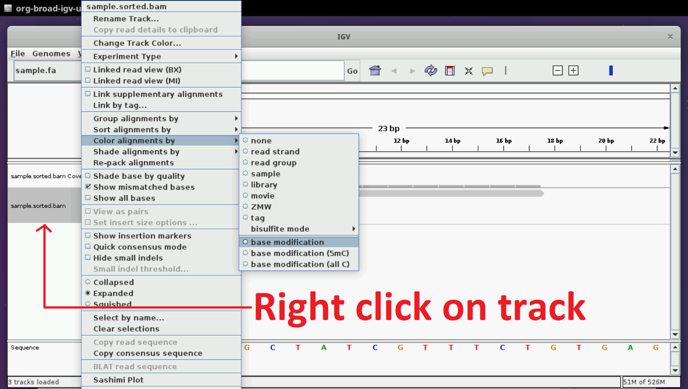

In this session, we will visualize modification data in mod BAM files using (1) genome
browsers (left) where we can rapidly scan data visually across different reads and different
regions on the genome, and (2) custom scripts (right) which allow us to see modification
density versus coordinate one read at a time.
We will also do some analysis on mod BAM files using `samtools` and `modkit` to show
how to re-construct the steps performed by genome browsers so that we can incorporate
it in our own scripts/commands.

As you can see from the figure above, each approach has its strengths and weaknesses.
Genome browsers give you an overall idea and one can zoom in to regions on the genome
and see data across multiple reads. But, beyond recognizing which regions are highly
modified on a read and which regions are not, one cannot pick out any details of
modification density such as gradients. On the right, we have plotted a read using
a custom script, which shows raw modification data (grey) and windowed modification
data (red). Here, we can see details per read but we cannot see multiple reads at
the same time. We will explore the details of these visualizations and how to make
them in this session.

Modification pipelines have very similar steps till the modifications are called, and very different
steps after the modifications have been called.
Our goal in these sessions is to introduce several tools
that can be utilized to analyze modifications after they are called and show some sample ways
in which they can be executed.
The experimentalist must decide whether to use these tools, how to run these tools,
and/or whether new tools are needed depending on their experiment. 

## Visualizing modification calls with IGV

### Loading a mod BAM file

Let us open IGV on the virtual machines using the instructions from the figure below,
like we did in the [alignment]({{ site.baseurl }}/materials/sequence-align-pycoqc) session.
If you are a self-study student, please open IGV on your computer.

Let us load the sacCer3 genome and the mod BAM file produced from the yeast dataset in the
[modification calling]({{ site.baseurl }}/materials/base-mod-detection) session following
the instructions in the figures below.

You should see two tracks immediately below the reference genome on top.

### Colouring tracks by modification and exploring the visualization

Now, we have to choose the option of 'Color by modification'.
Please follow the instructions in the figure below.

Now, you can zoom in to the genome. Select any region of size around 10 to 50 kb.
You should see something similar to the figure below.

The gray and green tracks on top result from a pile-up analysis and
show the modified and unmodified count versus genomic position
(any averaging calculation that operates over all reads at every base is called a
pile-up analysis).

Try clicking on a read and see if you can get the following dialog boxes.

Try zooming in to a length scale of just a few bases. You should see individual
bases marked as modified and unmodified.

We can look at the reads for a few more minutes to get familiar with the visualization.

## Reproducing IGV analyses with samtools

It is useful to know how to do some of the analyses above with
`samtools` or `modkit`

### Subsetting mod BAM files with samtools

<!-- TODO: flesh this out more -->
Many ways of subsetting. We will see three ways here: by read id, by region, randomly.

`samtools view -c dnascent.detect.mod.sorted.bam chrII:80000-90000`
`samtools view -b -e 'qname=="readID"' $modBAM`
`samtools view -s 0.05 "$mod_bam"`

### Ways to perform pileup with samtools

<!-- TODO: flesh this out more -->

Get coverage
`samtools coverage dnascent.detect.mod.sorted.bam`

Get modification
`samtools mpileup -M dnascent.detect.mod.sorted.bam`

### Pileup with modkit

<!-- TODO: flesh this out more -->
<!-- TODO: do we need --no-filtering? -->
`modkit pileup --no-filtering --mod-thresholds T:0.03 dnascent.detect.mod.sorted.bam test.08jan24.bed`

<!--
introduce thresholding and windowing but need not get into details here.
-->