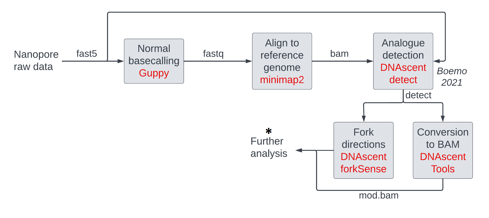
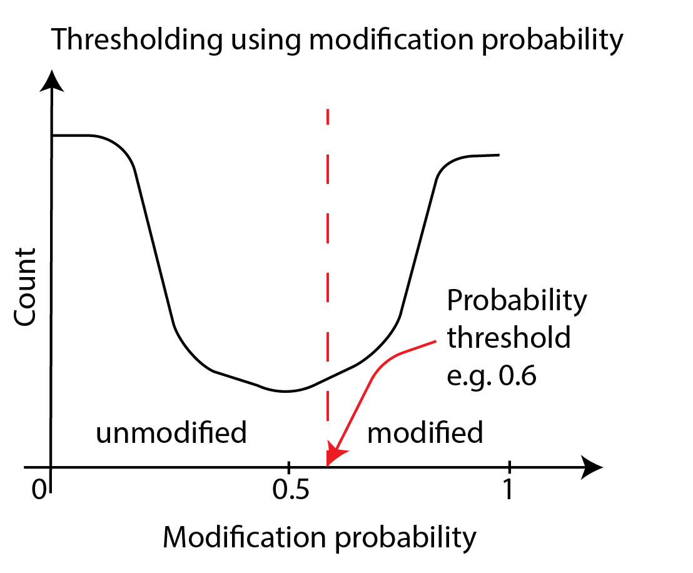
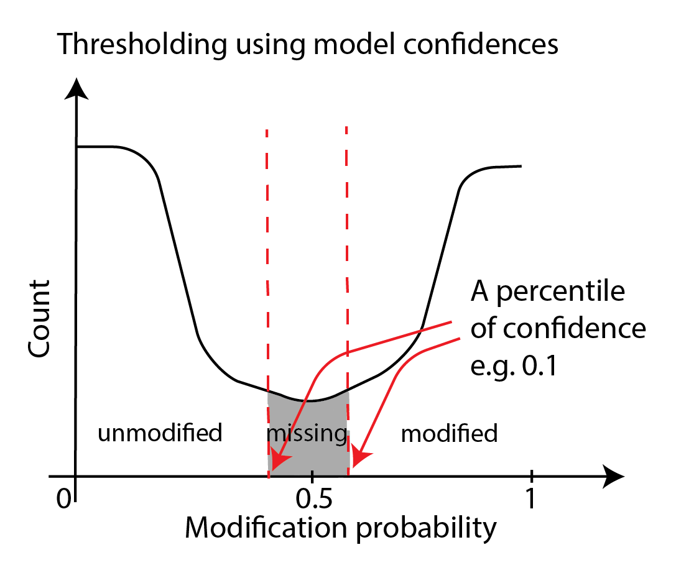

In this session, we will look at commands that manipulate modification 
data in mod BAM and produce summary statistics or plots.
Some of these commands are similar to those run behind the scenes
in a visualization software.
By running these commands ourselves, we get quantitative output
in a tabular format instead of an image format, and we can manipulate
this data further in our own scripts/pipelines.
These steps are all in the 'further analysis' section of our pipeline
and must be tuned or tailored to the experiment at hand by the experimenter.



The operations we will be running on mod BAM files are:
- thresholding
- making histograms of modification probabilities
- subsetting (either randomly, or by genomic location, or by mean modification density)
- windowing modification calls
- pileup of modification calls 


We can achieve most of these operations using the pre-existing packages `modkit` and `samtools`.
For windowing and for measuring mean modification densities across reads,
we will use our own tools due to an absence of ready-made tools.
In a later [session]({{ site.baseurl }}/materials/single-molecule-visualization),
we will use the package `modbamtools` for further manipulation.

## Refresher: convert mod BAM files to TSV using `modkit extract`

As we have seen in a previous [session]({{ site.baseurl }}/materials/mod-bam-format),
the raw mod BAM format is pretty hard to read for a person.
It is much more convenient to convert mod BAM files into a tabular format using
the `modkit extract` command.

```bash
input_bam_file= # fill with a suitable file
modkit extract $input_bam_file -
# - means the output goes to the standard output i.e. the screen.
# if your file is too large, pipe output through shuf and head.
# e.g. modkit extract $input_bam_file - | shuf | head -n 20
```

Please pay close attention to the first, second, third, fourth, and eleventh columns
which contain data corresponding to the read id, position along the read,
position along the reference, contig on the reference, and modification probability.

## Simple thresholding of mod BAM files with `modkit`

Thresholding is the process of converting soft modification calls to hard calls
i.e transforming a probability of modification per base per sequenced strand to a binary yes/no
(or a ternary yes/no/no etc. when multiple modifications are present).
The ground truth for an experimental sample is that every base on a DNA strand
is either modified or unmodified.
The probability of modification associated with every base in a mod BAM file
is due to uncertainty in the measurement procedure and this accumulates from
different stages of our experiment and subsequent analysis,
all the way from sample preparation to modification calling on a computer.
For some applications, we just want a simple yes/no answer to the modification question
and this uncertainty is not important.

There are two ways of thresholding, and they can be applied separately or together: 
- thresholding directly on modification probabilities,
- thresholding on model confidences.
Although the two are closely related, we will mostly be dealing with just thresholding
directly on probabilities.

The probability curve of modification per base usually looks like the following image.
Each point on the curve corresponds to a probability of modification `p_mod` and
a probability that the base is unmodified `p_unmod`; these add up to 1.


To threshold directly on probabilities, we convert bases with the probability of
modification `p_mod` above a threshold value into modified and bases with `p_mod` below
that value into unmodified. The simplest threshold value is 0.5.
If one wanted to make an informed choice about a threshold, one has to generate the histogram,
examine it, and make a decision - we will cover this later in this session.



We can execute the thresholding step with a threshold of 0.5 using `modkit`.

```bash
input_mod_bam= # fill suitably
output_mod_bam= # fill suitably
modkit call-mods --no-filtering $input_mod_bam $output_mod_bam
```

Run `modkit extract` on the input and output mod bam files.
You will see that the modification probability is now either
a value very close to zero or a value very close to one.

The reason we do not get zero or one is because mod BAM probabilities
are discretized by 1/256. So, modkit outputs the midpoint of
the first and the last interval as the lowest and the highest
probabilities respectively.

### (optional) Multiple modifications

Please note that if there are multiple modifications, a base
can exist in more than two states: unmodified, modification of the first type,
modification of the second type etc. 
Now `call-mods` assigned the state with the highest measured probability to the base.

### Syntax for thresholds other than 50%

If we want to use a threshold other than 0.5, the syntax is 

```bash
input_bam= # fill suitably
output_bam= # fill suitably
mod_code= # fill with mod code. e.g.: T for our BrdU data, m for 5mC.
threshold= # fill with a number between 0 and 1.
modkit call-mods --mod-threshold $mod_code:$threshold --filter-percentile 0 $input_bam $output_bam
```

### (optional) Using model confidences as thresholds

Another way to perform thresholding is through model confidences.
Model confidence is highest at bases with modification probabilities close
to zero or one. 
At these bases, the model is very confident that the base is unmodified
or modified respectively.
Model confidence is lowest at bases with modification probabilities close
to 0.5.
Here, the model is saying it can do no better than an unbiased coin toss.
A schematic of confidence percentiles on a modification-probability curve
is shown below.
As you can see, model confidences grow as one moves away from the midpoint
of 0.5 in either direction.
Model confidence is not a new measurement - we are just asking which parts
of the probability curve around the center have areas of 10%, 20% etc. of the whole curve.


One can threshold using the percentiles of confidence as shown below.
In principle, we are moving high-confidence model calls to the modified
or unmodified category and discarding the low-confidence model calls.
This approach is similar to the simple thresholding we have discussed
thus far but we use two thresholds here and the probabilities corresponding to the
two thresholds is not known beforehand.



This thresholding is accomplished through the `--filter-percentile` and/or
the `--filter-threshold` options of `modkit call-mods`, which may be used standalone or
in addition to the `--mod-threshold` parameter.
We will not be discussing this further; you can refer to the modkit documentation
[here](https://nanoporetech.github.io/modkit/advanced_usage.html#call-mods) if you are interested.


## Histograms of modification probabilities using `modkit`

In this section, we will calculate histograms of per-base modification probabilities.
One of its uses is helping us choose a threshold for a thresholding step that we were
discussing above.
Another use is to see if our experiment worked and we are seeing an expected number
of bases with modifications.

We will use the `modkit sample-probs` command. 
We operate the tool in the histogram mode `--hist` and want ten
bins in the histogram (`--buckets 10`), and wish to sample
1000 reads (`-n 1000`) to measure statistics (we are using 1000
to save runtime; usually a fraction of the BAM file is sufficient
for these calculations and we leave it to the experimenter to
determine what that fraction is for their dataset).

```bash
input_bam_file= # fill this suitably
modkit sample-probs $input_bam_file -o ./histogram --hist --buckets 10 -n 1000
```

The output files are deposited in the `./histogram` folder.
You should see three output files: `probabilities.txt`, `probabilities.tsv`
and `thresholds.tsv`.

<!-- TODO: fill what these files mean. what do we do about thresholds? -->

## Subsetting mod BAM files with samtools

We take a mod BAM file as input and produce a subset mod BAM file
as output by accepting or rejecting each entire read based on some criterion.
We will discuss five types of subsetting in this section:
- subset by genomic region.
- subset by read id
- subset randomly
- subset by modification amount per read
- any combination of the above

Following are examples of where subsetting is useful.

- to get a quick look at the data
- to downsample a dataset before calculations for which a representative, small number of reads are sufficient.
- to enrich for reads with some features e.g. highly modified, located near a gene of interest etc.

Before we perform any subset, we first count the total number of reads we have
in a mod BAM file.

Count number of reads
```bash
input_file= # fill with whatever input file you want to use
samtools view -c $input_file
```

### Subset by region

The following command makes a mod BAM file with only reads that pass through a given region.
Note that the subset will pick out entire reads,
not just the part of the read that overlaps with the region. 

```bash
contig= # fill with a suitable contig e.g. chrII
start= # fill with a suitable start coordinate e.g 80000
end= # fill with a suitable end coordinate e.g. 90000
input_file= # fill with whatever input mod BAM file you want to use
output_file= # fill with an output file name
samtools view -b -o $output_file $input_file $contig:$start-$end # perform subset
```

Let's do a quick check that our subset worked by counting the number of reads
and by examining their coordinates.

```bash
samtools view -c $input_file      # count reads of input file
samtools view -c $output_file     # count reads of output file
bedtools bamtobed -i $output_file | shuf | head -n 10 
    # look at a few output coordinates using bedtools bamtobed
    # to verify the reads overlap the region of interest.
    # you can run the bedtools command without the shuf and the head if
    # the $output_file is only a few lines long.
```

One can also subset by a list of regions; please follow the instructions in the `samtools view`
[documentation](http://www.htslib.org/doc/samtools-view.html) if you are interested.

### Subset by read id

The following command makes a mod BAM file with only the read of the read id of interest.

```bash
# fill the following values. 
# use any suitable mod BAM file and some read id of interest you have recorded.
input_file=
read_id=
output_file=
samtools view -b -e 'qname=="'$read_id'"' -o $output_file $input_file # perform subset
samtools view -c $output_file # count reads
```

One can subset by a list of reads using the `-N` option.
Please look at the `samtools view` documentation [here](http://www.htslib.org/doc/samtools-view.html).

### Subset randomly

The following command makes a mod BAM file with a subset of randomly-chosen reads
whose total number is set by the input fraction and
the total number of reads in the input file.

```bash
# fill the following values suitably. 
# use any suitable mod BAM file
input_file=
output_file=
fraction=0.05
samtools view -s $fraction -b -o $output_file $input_file # perform subset
samtools view -c $output_file # count reads
```

### Subset by modification amount

An experimenter may wish to isolate the reads with a minimum number of modified bases
in them for further analysis.
Unfortunately, there is no off-the-shelf `samtools` command or otherwise to achieve this.
We solve this problem using a custom script to generate mod BAM files with custom tags
at the end of each line with modification counts.
Then, samtools can be used to query this new mod BAM file to output the desired
high-modification-count subset.

We have implemented a custom script `count_mods_per_read.awk`
written for the tool `awk` to append
a numeric tag `XC` at the end of each thresholded mod BAM line.
The tag contains the number of modifications in that mod BAM line.
For example, the mod BAM line with the modification data `MM:Z:T+T?,0,0,0; ML:B:C,0,255,255`
gets the tag `XC:i:2` as there are two modifications.

The script is purely for demonstrative purposes and is not production-ready
as it will not work with all types of mod BAM files e.g. non-thresholded ones,
ones with multiple modifications, and a few others.
We wanted a simple demonstration of how to leverage pre-existing tools and our knowledge
of the mod BAM format to write tools ourselves when they are not available.
So we have not added all the additional features to make the script a
good production script for the sake of simplicity.

```bash
cd ~/nanomod_course_scripts/nanopore-mod-course/code
input_bam= # fill suitably with a thresholded modBAM file,
           # or threshold one first with `modkit call-mods` as we've
           # discussed earlier in this session and use it here
bam_with_counts= # fill suitably
samtools view -h $input_bam | awk -f count_mods_per_read.awk |\
  samtools view -b -o $bam_with_counts
# above line converts BAM -> SAM, runs script on it,
# and converts back to BAM.
# the output bam file contains the XC tag.
```

Let us display a table of some reads, their alignment coordinates, and their modification
counts using the following `bedtools bamtobed` command.
The output data is in the BED format, with the fifth column
containing the modification count from the XC tag (`-tag XC`).

```bash
bedtools bamtobed -i $bam_with_counts -tag XC | shuf | head -n 20
# you can drop the shuf and the head if the bam file is short enough
```

The advantage of storing modification counts using a tag in
the modBAM file is that one can use `samtools` to achieve
the desired high-modification-count subset now.
The following command extracts reads with at least 100 modified bases
per read.

```bash
output_bam= # fill suitably
samtools view -e '[XC]>100' -b -o $output_bam $bam_with_counts
```

One can combine other variables like alignment length with our modification
count in samtools queries.
We give an example below where we form a subset of reads with at least
one modified base per 100 aligned bases.

```bash
output_bam= # fill suitably
samtools view -e '[XC]/rlen>0.01' -b -o $output_bam $bam_with_counts
```

#### (optional) More details about the modification counting script

We have written the script in the AWK programming language.
The logic in the script is to read each line, isolate the column starting with ML,
split by comma, count the number of 255s in it, put this information
in an XC tag, and append it to the line.
This logic could easily be implemented in python or R as well.
We have chosen a tag starting with 'X' so as to not to interfere with other
BAM tags.

### Combining samtools filters

Several filters we have discusssed above can be combined. 

<!-- TODO: flesh this out more -->

### Ways to perform pileup with samtools

<!-- TODO: flesh this out more -->

Get coverage
`samtools coverage dnascent.detect.mod.sorted.bam`

Get modification
`samtools mpileup -M dnascent.detect.mod.sorted.bam`

### Pileup with modkit

<!-- TODO: flesh this out more -->
<!-- TODO: do we need --no-filtering? -->
`modkit pileup --no-filtering --mod-thresholds T:0.03 dnascent.detect.mod.sorted.bam test.08jan24.bed`


<!--
introduce thresholding and windowing but need not get into details here.
-->

<!-- TODO: can introduce modbedtools https://github.com/lidaof/modbedtools 
https://doi.org/10.1016/j.xgen.2023.100455 -->