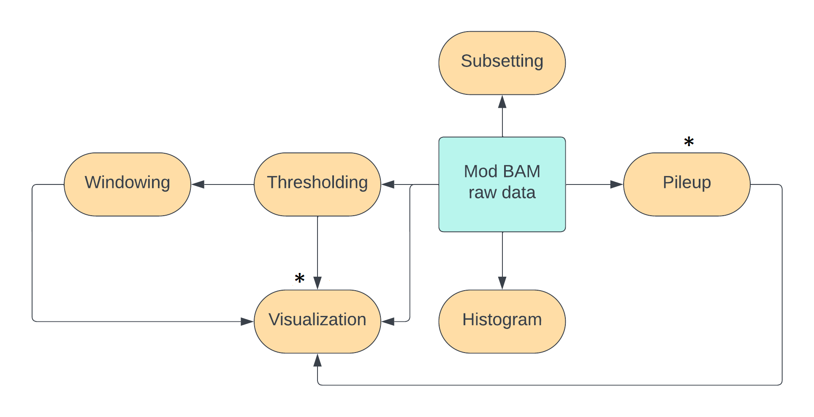
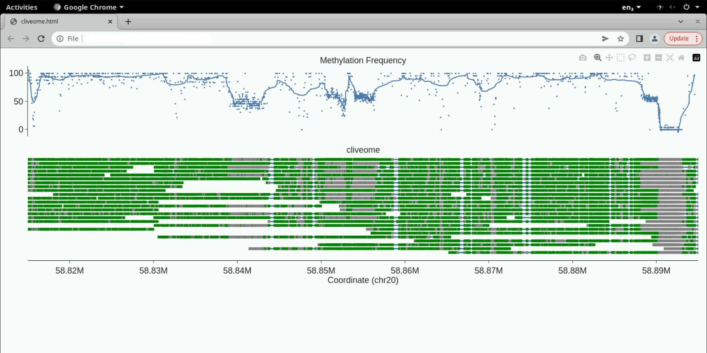

In this session, we will learn to use `modbamtools` another visualization package,
and learn how to do pileups.



## Visualizing reads and percent modification rates with modbamtools 

```bash
out_dir= # set to suitable directory
mkdir -p $out_dir # make directory if it does not exist

modbamtools plot -r chr20:58815000-58895000 \
  --out $out_dir --prefix cliveome --samples cliveome \
  ~/nanomod_course_data/human/bonito_calls.subset.sorted.bam
```

Open `cliveome.html` in the output directory.
You should see the screen below.



Top track is the percentage of methylation across reads versus coordinate
along the reference. The bottom tracks are individual molecules.
Move your mouse over them to see the read ids.
You can zoom in or zoom out of the plots using your mouse
on the top track.

One can optionally produce additional tracks to accompany the plot.
These can be annotations like genes or some signal versus the reference
coordinate produced by independent measurements.
Have a look at the modbamtools tutorial
[here](https://rrazaghi.github.io/modbamtools/tutorial/) to explore these options.
We have chosen the same genomic location as the example in the tutorial, so
we can compare the methylation pattern between the two examples.
We have chosen a green-grey colour scheme for our plots here compared
with the red-blue of the tutorial.

## Calculation of modification statistics with modbamtools

One can calculate modification statistics across several regions with `modbamtools`.

```bash
region_file= # fill suitably
echo -e "chr20\t58100000\t58200000" > $region_file;   
echo -e "chr20\t59100000\t59200000" >> $region_file;

output_bed_file= # fill suitably

modbamtools calcMeth --bed $region_file \
    --threads 3 \
    --out $output_bed_file \
    ~/nanomod_course_data/human/bonito_calls.subset.sorted.bam
```

A few columns are added to the output bed file: average percent modification,
standard deviation of modification, and the coverage.
This calculation offers us an alternate to `modkit sample-probs` as
the style of the input options is slightly different.

## Pileup of reference-anchored mod BAM files with `modkit`

A pileup is any calculation that produces one number per base on a reference
genome by performing an operation across all data available at that base
across all reads passing through that base.
In addition to the percent-modification track produced by `modbamtools`
above, we have also encountered pileups in the previous
[session]({{ site.baseurl }}/materials/genome-browser-visualization)
on visualization in genome browsers as shown in the figure below.


Per base on the reference genome, we can calculate
- the total number of reads
- the total number of modifications
- the fraction of modified reads

```bash
input_mod_bam=         # fill suitably
output_dir=            # fill suitably
modkit pileup --no-filtering --mod-thresholds m:0.5\
  $input_mod_bam "$output_dir"/pileup.bed
```

Now, one can inspect a few lines from the output file

```bash
# inspect the first few lines
head -n 20 "$output_dir"/pileup.bed
# inspect a few randomly chosen lines
cat "$output_dir"/pileup.bed | shuf | head -n 20
```

### (optional) Coverage using `bedtools`

An alternate way to get the coverage,
which is a count of the number of reads passing
through each base, one can do

```bash
input_mod_bam=         # fill suitably
output_dir=            # fill suitably
mkdir -p "$output_dir" # make output directory if need be
bedtools genomecov -ibam $input_mod_bam -bga >\
  "$output_dir"/coverage.bedgraph
```

Now, one can inspect a few lines from the output bedgraph

```bash
# inspect the first few lines
head -n 20 "$output_dir"/coverage.bedgraph
# inspect a few randomly chosen lines
cat "$output_dir"/coverage.bedgraph | shuf | head -n 20
```

This method will work even if the BAM file has no modification
information as coverage is just a count of number of reads
passing through each position on the reference irrespective
of whether they contain modifications or not.

### (optional) Modification pileup with `samtools`

One can also perform pileups of modification with `samtools`.
The command is specified below.
The output format is a little hard to understand and we will not be discussing this further.
Please consult the documentation [here](https://www.htslib.org/doc/samtools-mpileup.html)
if you want to learn more.

```bash
input_mod_bam= # fill suitably
output_file= # fill suitably
samtools mpileup -M $input_mod_bam > $output_file
```